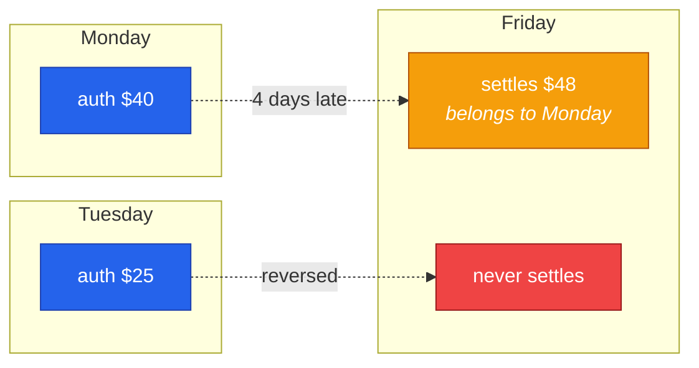
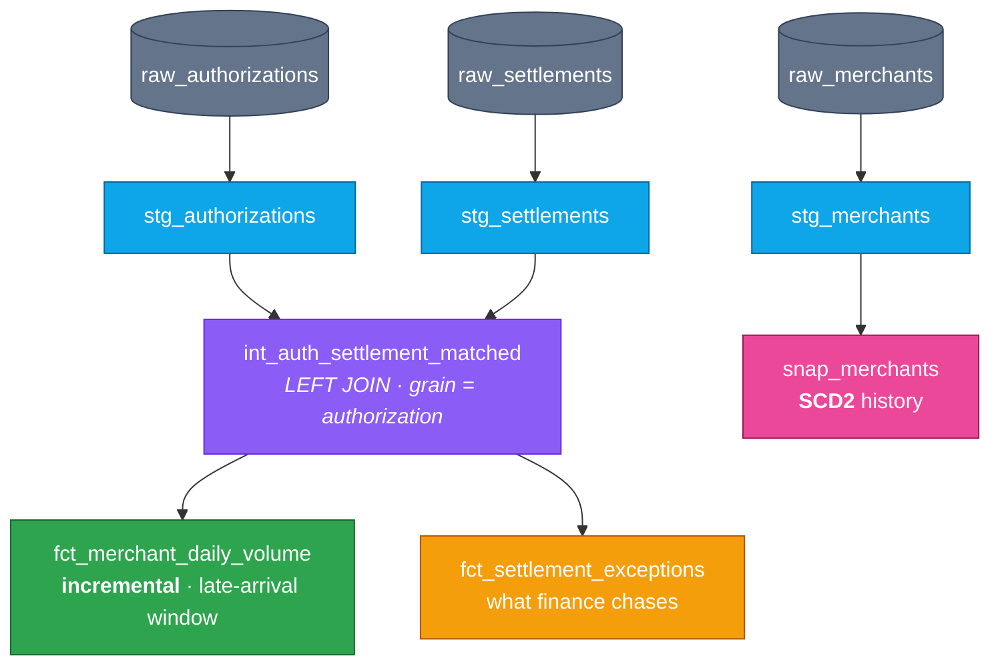

<h1 align="center">merchant-settlement-dbt</h1>

<p align="center">
  <b>What happens when a card settlement turns up four days late?</b><br>
  A dbt project about the gap between the money being <i>authorized</i> and the money actually <i>moving</i>.
</p>

<p align="center">
  
  
  
  
</p>

---

## The problem

When you tap your card, two separate things happen, and they do not happen at the same time.

First the **authorization**: the bank checks the money is there and holds it. Then later the **settlement**: the money actually moves. That gap can be a few hours or it can be nine days. Sometimes the settlement never arrives at all, because the payment was reversed or dropped.

The amounts often do not match either. Your card is authorized for $40 at dinner, you add a tip, and $48 settles.

I work on pipelines like this at American Express. This is the part that catches people out:

> A day you already reported can still change tomorrow.

None of this throws an error. Nothing fails. You just get a number that is wrong, and usually someone in finance notices before you do.



Monday's total was too low all week, and nothing said so.

---

## How it's built



```bash
python -m venv .venv && ./.venv/bin/pip install dbt-duckdb
./.venv/bin/python scripts/generate_data.py     # synthetic auth + settlement streams
./.venv/bin/dbt build --profiles-dir .          # 33 models, snapshots and tests
```

You do not need a warehouse account. It runs on DuckDB as soon as you clone it.

---

## The three parts worth reading

### 1. The late-arrival window

This is the main idea. The obvious way to write an incremental model is to process today's rows only. That does not work here, because a settlement arriving today might belong to **last Tuesday**, and the model would never look at Tuesday again.

So instead it goes back over the last few days every run and rewrites those days completely:

```sql
{{ config(materialized='incremental',
          unique_key=['merchant_id','auth_date'],
          incremental_strategy='delete+insert') }}


where auth_date >= (
    select coalesce(max(auth_date), '1900-01-01'::date)
             - interval '{{ var("settlement_lag_days") }} days'
    from {{ this }}
)

```

**I tested this instead of assuming it.** I added a settlement that arrived 4 days late and ran the model again:

| | open auths | settled |
|---|---|---|
| before | 4 | $173.78 |
| **after** | **3** | **$187.87** |

It went back and fixed a day it had already written. A model filtered on today only would leave that day wrong forever, and nothing in the logs would tell you.

### 2. Why it's a LEFT JOIN

An inner join looks fine, but it quietly drops the rows you most need to see:

| status | what it means | rows |
|---|---|---|
| `SETTLED` | matched | 22,564 |
| `PENDING` | not settled *yet*, still inside the window | ~578 |
| `UNSETTLED` | past the window, never coming | ~1,830 |

The bottom two rows vanish with an inner join, so merchant volume comes out too low and nothing complains. The table also stays at one row per authorization, so the join cannot double count. There is a `unique` test on `auth_id` checking exactly that.

### 3. A test I got wrong, and fixed properly

I wrote a test saying settled volume for a merchant-day should not be more than 30% above authorized volume. It **failed** on 2 merchant-days out of 2,699.

Before changing the number I looked at the two rows. They had **3 and 13 transactions**. On a day with three transactions, one normal $40 to $56 tip moves the whole ratio. The data was fine. My test was too simple.

The easy fix is to raise the 30% to something higher, but that makes the test weaker everywhere just to keep two rows quiet. So instead I only apply it to days with enough transactions, and wrote down why:

```sql
where auth_count >= 20                      -- below this, one tip dominates
  and settled_amount > authorized_amount * 1.30
```

If a test keeps failing on good data, people stop paying attention to it. Quiet days are covered by `fct_settlement_exceptions` instead, which is a report to read rather than something that stops the build.

---

## SCD2, and why not just overwrite

Merchants get moved between risk tiers. If you just overwrite the merchant table, all the old transactions suddenly look like they belonged to the new tier. Last quarter's numbers change, and running the same report twice gives two different answers.

```
snap_merchants: 68 rows · 60 current · 8 historical

merchant 2   risk=LOW    valid 2026-08-02 → 2026-09-10
merchant 2   risk=HIGH   valid 2026-09-10 → CURRENT
```

Now a transaction can join to the version of the merchant that was correct on the day it happened.

---

## Tests

 `unique` · `not_null` · `relationships` across both streams · `accepted_values` on status and exception enums · unique-combination on the mart's grain · a singular reconciliation invariant

---

## Layout

```
models/staging/        stg_authorizations · stg_settlements · stg_merchants
models/intermediate/   int_auth_settlement_matched
models/marts/          fct_merchant_daily_volume · fct_settlement_exceptions
snapshots/             snap_merchants  (SCD2)
tests/                 custom generic tests + the reconciliation invariant
scripts/               synthetic data generator
```

## About the data

`scripts/generate_data.py` uses a fixed seed so every build is the same, and the data is messy on purpose. Some settlements arrive 7 to 9 days late, which is outside the allowed window. Some amounts are just above the 25% over-capture line and some just below it, so the rule is actually tested (1.18x and 1.20x are normal tips and should not trigger it, 1.40x should). Some merchants change risk tier halfway through.

If the data matched up neatly, a broken join would still look correct, and the project would not prove anything.

---

<p align="center">
  <sub>Built by <a href="https://github.com/swapnatondapu7-netizen">Swapna Tondapu</a>. I wanted to do the transformations, dependencies and tests I already do by hand at American Express, but in dbt.</sub>
</p>
