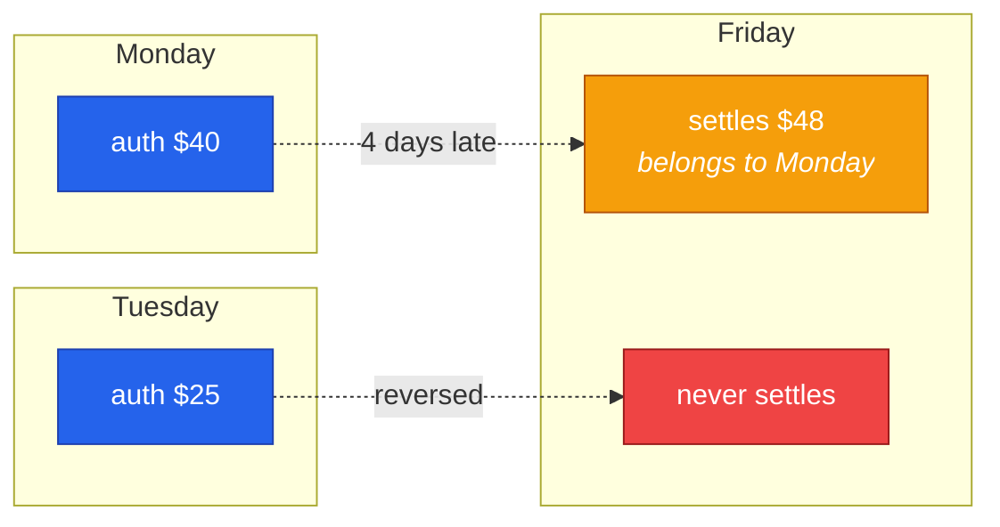
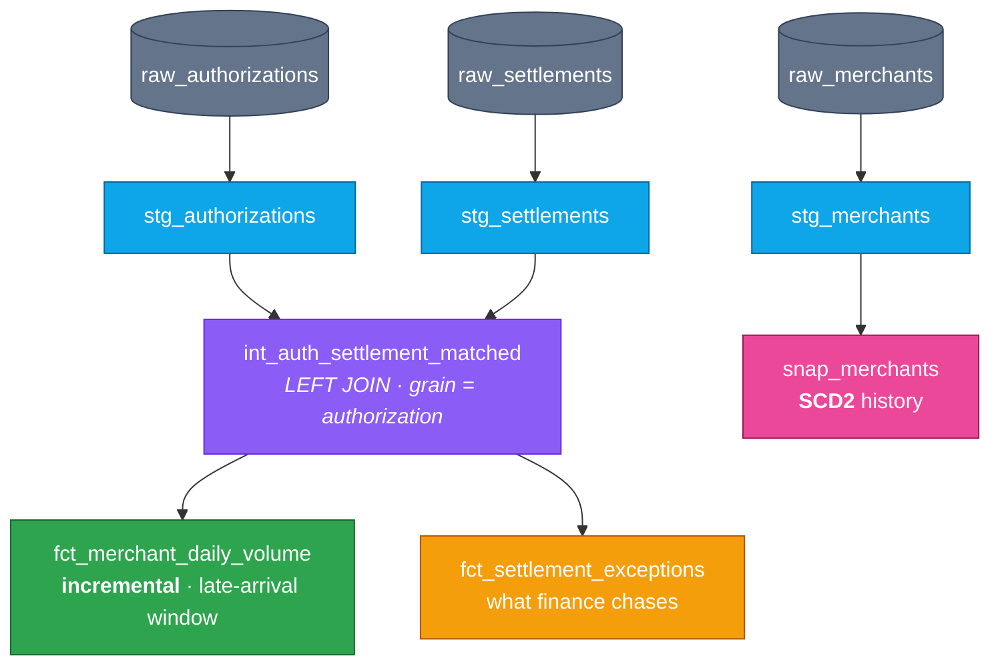

<h1 align="center">merchant-settlement-dbt</h1>

<p align="center">
  <b>What happens when a card settlement shows up four days late?</b><br>
  A dbt project about the awkward gap between <i>authorized</i> and <i>settled</i>.
</p>

<p align="center">
  
  
  
  
</p>

---

## The problem

When you tap your card, two things happen — and they don't happen together.

First an **authorization**: the money is checked and held. Later, a **settlement**: the money actually moves. "Later" is doing a lot of work in that sentence. It might be the same evening. It might be nine days. Sometimes it never comes at all, because the transaction was reversed or abandoned.

And the amounts often don't match either. You authorize $40 for dinner, tip, and $48 settles.

I work on pipelines like this at American Express, and this is the thing that bites people:

> A day you already reported can still change tomorrow.

Every one of these quirks breaks a naive pipeline **silently**. No error, no failed job — just a number that's quietly wrong, and a finance team that finds out before you do.



Monday's total was wrong all week. Nothing told you.

---

## How it's built



```bash
python -m venv .venv && ./.venv/bin/pip install dbt-duckdb
./.venv/bin/python scripts/generate_data.py     # synthetic auth + settlement streams
./.venv/bin/dbt build --profiles-dir .          # 33 models, snapshots and tests
```

No warehouse account needed — it runs on DuckDB, straight after clone.

---

## The three things worth reading

### 1. The late-arrival window

This is the heart of it. The obvious way to write an incremental model is "process today's rows". That's wrong here, because a settlement landing today might belong to **last Tuesday** — a day this model will never look at again.

So instead it reprocesses a trailing window and replaces those days wholesale:

```sql
{{ config(materialized='incremental',
          unique_key=['merchant_id','auth_date'],
          incremental_strategy='delete+insert') }}


where auth_date >= (
    select coalesce(max(auth_date), '1900-01-01'::date)
             - interval '{{ var("settlement_lag_days") }} days'
    from {{ this }}
)

```

**I tested this rather than trusting it.** Injected a settlement arriving 4 days late, re-ran the model:

| | open auths | settled |
|---|---|---|
| before | 4 | $173.78 |
| **after** | **3** | **$187.87** |

It reached back and fixed a day it had already written. A `where auth_date = current_date` version leaves that day wrong forever, with nothing in the logs.

### 2. Why it's a LEFT JOIN

An inner join looks fine and quietly deletes your problem cases:

| status | what it means | rows |
|---|---|---|
| `SETTLED` | matched | 22,564 |
| `PENDING` | not settled *yet*, still inside the window | ~578 |
| `UNSETTLED` | past the window, never coming | ~1,830 |

Those bottom two just disappear under an inner join, and merchant volume comes out low with no error anywhere. The grain stays on the authorization so the join can't inflate counts either — there's a `unique` test on `auth_id` guarding exactly that.

### 3. A test I got wrong, and fixed properly

I wrote an invariant: aggregate settled volume shouldn't exceed authorized by more than 30%. It **failed** — on 2 merchant-days out of 2,699.

I looked before loosening it. Both had **3 and 13 transactions**. On a three-transaction day, one legitimate $40→$56 tip moves the whole ratio. The data was fine; my test was naive.

The tempting fix is to raise the threshold. That weakens it everywhere to satisfy two rows. So instead it got a volume floor and a comment explaining why:

```sql
where auth_count >= 20                      -- below this, one tip dominates
  and settled_amount > authorized_amount * 1.30
```

A test that fails on correct data teaches people to ignore tests. Low-volume days are covered by `fct_settlement_exceptions` instead — a report, not a build-blocker.

---

## SCD2, and why not just overwrite

Merchants get re-tiered. If you overwrite the dimension, every historical fact silently re-attributes itself to the merchant's *current* risk tier — so last quarter's numbers change, and the same report run twice gives two answers.

```
snap_merchants: 68 rows · 60 current · 8 historical

merchant 2   risk=LOW    valid 2026-08-02 → 2026-09-10
merchant 2   risk=HIGH   valid 2026-09-10 → CURRENT
```

Now a fact can join to the version of the merchant that was true on its own date.

---

## Tests

 `unique` · `not_null` · `relationships` across both streams · `accepted_values` on status and exception enums · unique-combination on the mart's grain · a singular reconciliation invariant

---

## Layout

```
models/staging/        stg_authorizations · stg_settlements · stg_merchants
models/intermediate/   int_auth_settlement_matched
models/marts/          fct_merchant_daily_volume · fct_settlement_exceptions
snapshots/             snap_merchants  (SCD2)
tests/                 custom generic tests + the reconciliation invariant
scripts/               synthetic data generator
```

## About the data

`scripts/generate_data.py` is seeded, so builds are reproducible — and it's deliberately awkward. A 7–9 day settlement tail *outside* the agreed window. Drift values on **both sides** of the 25% over-capture line (1.18× and 1.20× are ordinary tips and must *not* trip it; 1.40× must). Merchants whose attributes change mid-window.

Data that matched up neatly would let a broken join look correct — which would rather defeat the point.

---

<p align="center">
  <sub>Built by <a href="https://github.com/swapnatondapu7-netizen">Swapna Tondapu</a> — I wanted to express in dbt the transformation, DAG and testing work I do by hand at American Express.</sub>
</p>
